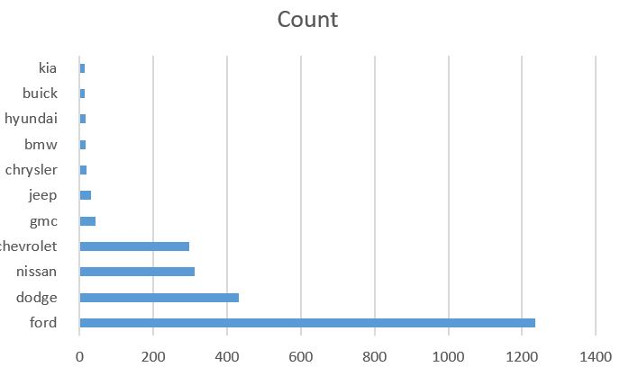

# map-reduce-nikhil-pannala
## Data Description
[Data Link](https://www.kaggle.com/doaaalsenani/usa-cers-dataset/version/1)

The dataset contains the following columns:
- index
- price
- brand
- model
- year
- title_status
- mileage
- color
- vin
- lot
- state
- country
- time
## Data Story:

I found the Kaggle USA Cars dataset regarding car sales of different brands interesting. I wanted to know different car brands that were on sale in United States of America. 

From the initial dataset, I'll map to key-value pairs: brand, count. 
Then, I'll use the terminal "sort" to get them sorted in case they aren't. 
Then, I'll reduce all the key-value pairs for one brand to a single value: brand, count. 

```PowerShell
cat USA_cars_datasets.csv | python datamapper.py | sort  | python datareducer.py > pannala-output.txt

```

The result is only 29 records, so I'll use Excel to chart it. 
Then I'll filter the data and find the top ten car brands that are on sale in United States of America.


